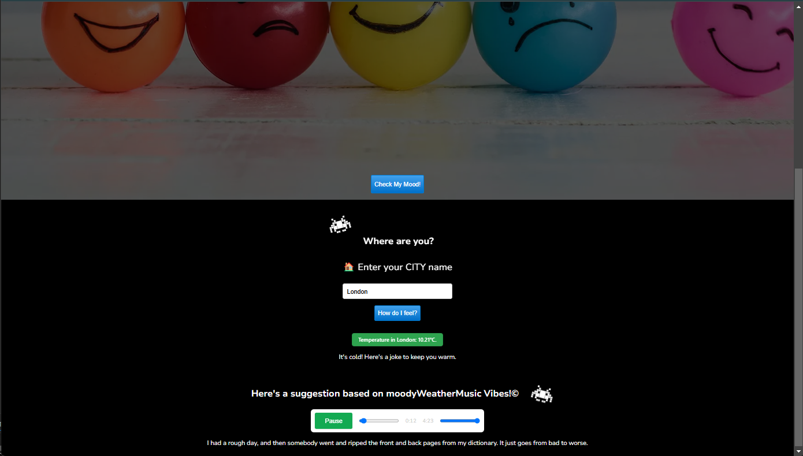

# MoodyWeather 🎶🌧️

**MoodyWeather** is a site that combines music and weather to brighten your day! Enter your city, and the site will suggest a song that matches the current weather. If it’s cold, you’ll also get a joke to lift your spirits. 🥶😆




---

## 🚀 Features

1. **Check My Mood:** Click a button to reveal the "mood of the weather."
2. **Music Recommendations:** Enter your city, and MoodyWeather uses APIs to suggest a song that fits the weather.
3. **Cold Weather Jokes:** When temperatures drop, receive a joke to add some lightheartedness to your day.

---

## 🌐 Technologies Used

- **Frontend:** HTML, CSS (with subtle animations), JavaScript
- **APIs:** Weather and music APIs to provide personalized suggestions
- **Frameworks and Tools:** 

---

## 🎉 Challenges and Learnings

This project was built during a hackathon, where the main challenge was making the APIs interact smoothly, especially under tight time constraints. Facing these challenges in a limited time frame was an invaluable lesson in resilience and problem-solving.

A big thank you to Sid Miguel and Scribbio for their support and inspiration throughout this project. Your input was essential!

---

## 👨‍💻 How to Use

To try out MoodyWeather yourself, follow these steps:

1. **Clone this repository:**
   ```bash
   git clone https://github.com/your-username/MoodyWeather.git
   cd MoodyWeather


## 🌦️ What's the Weather Mood Today?

🌞 **Sunny and Bright!** – Time to shine! 😎

🌧️ **Rainy?!** – *"Why did the man put his money in the blender? Because he wanted some liquid assets!"* 😂

❄️ **Chilly and Frosty!** – *"What’s a snowman’s favorite snack? Ice Krispies!"* 🥶

☁️ **Cloudy and Gloomy...** – *"How do hurricanes see? With one eye!"* 👀

🌈 **Rainbow Alert!** – A splash of color after the rain 🌈✨

🌩️ **Stormy and Fierce!** – *"Why did the lightning break up with the thunder? It found someone more electrifying!"* ⚡

[](https://git.io/typing-svg)


