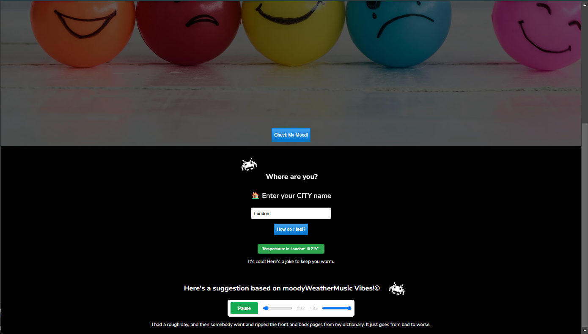

# MoodyWeather 🎶🌧️

**MoodyWeather** is a web app that pairs music with the weather to add a bit of fun to your day! Just enter your city, and MoodyWeather will suggest a song that matches the current weather. If it’s cold, you’ll even get a joke to lift your spirits. 🥶😆



---

## 🚀 Features

1. **Check My Mood:** Click a button to reveal the "mood" of the weather.
2. **Music Recommendations:** Enter your city, and MoodyWeather uses the OpenWeather API to suggest a song that fits the weather.
3. **Cold Weather Jokes:** When temperatures are low, MoodyWeather uses the Dad Jokes API to provide a joke for a bit of fun.

---

## 🌐 Technologies Used

- **Frontend:** HTML, SASS, JavaScript
- **APIs:**
  - **OpenWeather API** for real-time weather information based on city
  - **Dad Jokes API** to add a bit of humor on chilly days
- **Frameworks and Tools:** Vanilla HTML, SASS, and JavaScript for a lightweight experience

---

## 🎉 Challenges and Learnings

This project was built during a hackathon, where the biggest challenge was integrating the APIs smoothly under time constraints. It was a valuable learning experience in debugging and optimizing API usage within a limited timeframe.

---

## 👨‍💻 How to Use

To try out MoodyWeather yourself, follow these steps:

1. **Clone this repository:**
   ```bash
   git clone https://github.com/your-username/MoodyWeather.git
   cd MoodyWeather
   ```

## 🌦️ What's the Weather Mood Today?

🌞 **Sunny and Bright!** – Time to shine! 😎

🌧️ **Rainy and Cozy!** – Here's a joke to lift your spirits: _"Why did the man put his money in the blender? Because he wanted some liquid assets!"_ 😂

❄️ **Chilly and Frosty!** – _"What’s a snowman’s favorite snack? Ice Krispies!"_ 🥶

☁️ **Cloudy and Gloomy...** – _"How do hurricanes see? With one eye!"_ 👀

🌈 **Rainbow Alert!** – A splash of color after the rain 🌈✨

🌩️ **Stormy and Fierce!** – _"Why did the lightning break up with the thunder? It found someone more electrifying!"_ ⚡

## 🛠️ The Journey

It was late at night, and the clock was ticking as the hackathon deadline loomed. ⏰ The APIs weren’t cooperating, and I was knee-deep in debugging, but I knew I had to make it work. Fueled by determination (and a lot of coffee ☕), I kept pushing through the setbacks. In the end, seeing MoodyWeather come to life made every challenge worth it – a reminder of why I love building things from scratch. 🚀

## 🤝 Special Thanks

A big thank you to **Sid Miguel** and **Scribbio** for their support and inspiration throughout this project. Your input was essential!

[](https://git.io/typing-svg)
